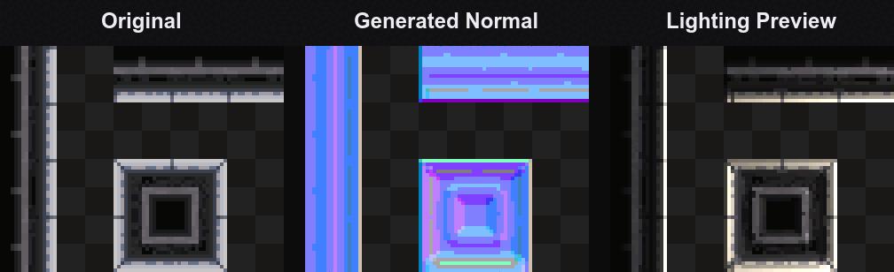

# Pixel Normal Generator

Generate stylized normal maps for pixel art directly inside Aseprite.

- **Alpha mode** — volume and rim-light straight from the silhouette
- **Height / Channel mode** — normals from luminance or an R/G/B/A channel
- **Paint Height mode** — convert a hand-painted black-and-white height layer
- **Live light preview** — move a light over the result before committing
- **Posterized, pixel-art output** — stepped normals that keep crisp pixel edges
- **Normal and/or Height export** — output the normal map, the height map, or both



> **The trick:** smooth the *heightmap* before Sobel, then posterize the *normal* — never
> blur the finished normal map. That keeps the stepped, pixel-art look and preserves crisp
> pixel edges instead of an over-beveled emboss.

---

## Quick start

```text
Install
  ↓
Edit → FX → Pixel Normal Generator
  ↓
Generate
  ↓
Export & use in your engine
```

---

## Why

Generic height-to-normal tools were built for photographic textures. Point them at pixel
art and every 1px detail becomes an aggressive bevel/emboss. This
extension is tuned for small sprites: gentle heightmap denoise + blur *before* the gradient,
posterized output, optional silhouette rim-light, and per-mode control so the lighting still
respects the pixel-art aesthetic.

## Modes

The generator runs in one of three modes:

1. **Normal from Alpha** — height = the sprite's alpha silhouette. Flat on top, sloped at
   the edges, giving clean rim-light and edge volume. The safest, most predictable mode.
2. **Normal from Luminance / Channel** — height = luminance or a chosen R/G/B/A channel of
   the art (the classic post workflow). Great for metal, stone, walls, dirt, pipes, tiles.
   Pick the channel that's *least* prominent in your sheet for the cleanest result.
3. **Paint Height Layer** — you paint a separate black-and-white height map on its own layer,
   and the extension converts *that* to a normal map. The proper choice for hero assets where
   you want full manual control over the volume.

## Pipeline

```
source image (frame composite, or a chosen height layer)
  → heightmap  (luminance | R/G/B/A channel | alpha mask)
  → denoise    (optional 3×3 median, kills single-pixel spikes)
  → blur       (separable Gaussian on the HEIGHTMAP, radius/passes)
  → Sobel      (dx, dy at a configurable pixel step / sample distance)
  → normal     normalize(vec3(-dx·strength, -dy·strength, 1))
  → encode     R = x·0.5+0.5,  G = y·0.5+0.5,  B = z·0.5+0.5
  → rim/edge   (optional) blend alpha-derived edge normals near the silhouette
  → posterize  quantize channels into N steps (the pixel-art "stepping")
  → alpha      preserve the original sprite's alpha
```

## Parameters

| Parameter            | What it does                                                              |
|----------------------|---------------------------------------------------------------------------|
| **Mode**             | Alpha / Luminance-Channel / Paint Height Layer                            |
| **Height source**    | Luminance, Red, Green, Blue, or Alpha (for the channel mode)              |
| **Strength**         | Bump intensity — scales the gradient before normalization                 |
| **Blur radius**      | Gaussian blur applied to the heightmap *before* Sobel                     |
| **Blur passes**      | Repeat the blur to approximate a wider, smoother Gaussian                 |
| **Denoise**          | 3×3 median pre-pass to remove lone noisy pixels                           |
| **Pixel step**       | Sobel sample distance — larger = chunkier, lower-frequency normals        |
| **Posterize steps**  | Number of quantization levels for the final normal (post used 5)          |
| **Invert X / Y**     | Flip the X/Y normal axis (e.g. OpenGL/Godot vs DirectX Y convention)      |
| **Preserve alpha**   | Copy the source alpha onto the normal map (keeps the silhouette)          |
| **Rim from alpha**   | Overlay alpha edge normals near the silhouette for a subtle rim-light     |
| **Rim width/strength** | How far in from the edge the rim reaches, and how strongly it bends     |
| **Generate**         | Normal map, Height map, or both (separate layers/sprites)                 |
| **Output**           | New layer(s) in the current sprite, or a brand-new sprite                 |
| **All frames**       | Generate for every frame (animations / sheets)                           |

### Height map output

Besides the normal map you can output the **processed height map** (the denoised,
blurred grayscale elevation the Sobel reads — white = high). It's left smooth on
purpose: a height map is most useful for parallax, self-shadowing and ambient-occlusion
in a shader, where you usually *don't* want it posterized. The movable-light preview
always shows the lit **normal** (the height map has nothing interactive to preview).
Layers/sprites are named `Normal Map` and `Height Map`, are reused on re-run (never
stacked), and are automatically excluded as a height source.

## Live preview

The dialog includes a **canvas preview with a movable light**: move your mouse over the
preview and a virtual point-light follows it, lit per-pixel with the generated normals so you
can dial in strength, posterize and the X/Y inversion before committing. (This is the ground
truth for getting the Y-flip right for your engine.)

## Installation

1. Download `pixel-normal-generator.aseprite-extension` from the
   [Releases](../../releases) page (or build it — see below).
2. In Aseprite: **Edit → Preferences → Extensions → Add Extension**, pick the file.
3. The command appears under **Edit → FX → Pixel Normal Generator** (and you can bind a key
   to it in Keyboard Shortcuts).

### Building the extension from source

An `.aseprite-extension` is just a `.zip` with `package.json` and the `.lua`
files at the archive **root**. Use the provided build script:

```powershell
# Windows / PowerShell
./build.ps1
```

```sh
# Git Bash / macOS / Linux
./build.sh
```

Either produces `dist/pixel-normal-generator.aseprite-extension`. During
development you can also point Aseprite straight at the repo: drop these files
(`package.json`, `main.lua`, `normalmap.lua`, `ui.lua`) into your Aseprite
`extensions/pixel-normal-generator/` folder.

## Usage

1. Open your sprite or sprite sheet.
2. **Edit → FX → Pixel Normal Generator**.
3. Pick a mode and tune the parameters while watching the movable-light preview.
4. **Generate** — the normal map lands in a new layer (or new sprite).
5. Export the normal-map layer/sprite and wire it up in your engine.

### Godot note

Godot uses **OpenGL-style** normal maps (Y+ is up). If your lighting looks inverted, toggle
**Invert Y**. Also remember to set your `PointLight2D` / `Light` **height** so its range
actually interacts with the normal map — otherwise a character can read as pitch-black while
standing in light.

## Notes & behaviour

- **Re-running is safe.** Output to a *New layer* reuses the `Normal Map` / `Height Map`
  layers by name (it overwrites, it never stacks duplicates — even after closing and
  reopening the dialog), and those layers are automatically excluded from the height
  source, so tweak-then-regenerate works.
- **New sprite output** opens the normal map as its own RGB document. To keep
  tuning afterwards, switch back to the original sprite first (the dialog only
  previews/generates while your source sprite is active).
- **Live preview is an approximation on big sheets.** It runs the pipeline at up
  to 128 px for responsiveness; blur radius / pixel step are in pixels, so the
  final full-resolution output is the source of truth. Move the light to judge it.
- **Non-RGB sprites** (Indexed / Grayscale) are auto-routed to a New sprite,
  since a normal map needs RGB.
- Requires **Aseprite v1.3+** (the canvas preview uses the GraphicsContext API).

## Credits

- Inspired by the r/godot post *"A (time) poor man's normal map generation for
  pixel art"* (Krita: noise-reduce → blur → height-to-normal → posterize).
- Built for Aseprite's Lua scripting API.

## License

[MIT](LICENSE) © 2026 ImMediocre
